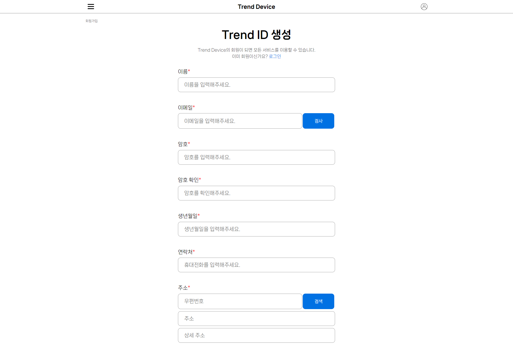
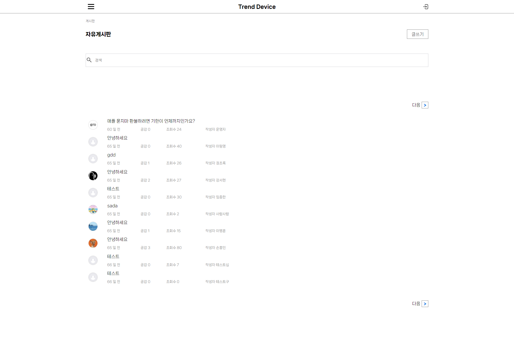

# Treand Device

개발기간: 2023/10/11 ~ 2023/11/17

팀원 : 김우주, 서유진, 윤영식

### 사이트바로가기: http://eugene3322.dothome.co.kr/TDsite/php/main/main.php

## Trend Device 서비스 기획

## 개요

`Trend Device` 서비스는 휴대폰을 비교하고, 사용자들끼리 토론이 가능한 휴대폰 비교 서비스입니다. 이 서비스는 사용자들이 고민 중인 휴대폰 두 개 이상 선택하여 토론 주제로 올릴 수 있으며, 다양한 의견을 듣고 사람들의 반응을 통해 휴대폰 선택에 도움을 받을 수 있는 플랫폼을 제공합니다.

## 기능

1. **휴대폰 비교 및 스펙 확인**

사용자들은 애플과 삼성의 다양한 휴대폰 모델을 비교할 수 있으며, 기술적인 스펙과 기능을 확인할 수 있습니다.

2. **토론 주제 생성**

사용자들은 자신이 고민 중인 휴대폰 두 개를 선택하여 토론 주제로 올릴 수 있습니다. 

3. **사용자 토론 공간**

생성된 토론 주제에 대해 다양한 의견을 나눌 수 있는 토론 공간을 제공합니다. 사용자들은 자유롭게 의견을 나누고 다른 사용자들의 경험과 생각을 듣는 것이 가능합니다.

4. **평가 및 리뷰**

사용자들은 자신이 사용한 휴대폰에 대한 평가와 리뷰를 남길 수 있습니다. 이를 통해 다른 사용자들은 실제 사용자들의 의견을 확인하며 더 나은 결정을 내릴 수 있습니다.

5. **트렌드 분석**

 `Trend Device`는 사용자들의 의견과 선호도를 분석하여 최신 휴대폰 트렌드를 제공합니다. 이를 통해 사용자들은 휴대폰 시장 동향을 파악할 수 있습니다.

## 목표

 `Trend Device`의 목표는 사용자들이 휴대폰 선택에 있어서 더 나은 결정을 내릴 수 있도록 돕는 것입니다. 서로 다른 의견을 듣고 토론을 통해 사용자들이 더욱 신중하게 휴대폰을 선택할 수 있도록 하며, 휴대폰 시장의 트렌드를 함께 공유하는 플랫폼을 제공합니다.

 ## 레퍼런스

1. 애플
2. 삼성
3. 세티즌

## 사이트 맵

## 기능구현

1. 회원가입

2. 로그인

3. 마이페이지

4. 제품

    - 카테고리별 상품 보기
    - 상품 입력하기
    - 상품 수정하기
    - 상품 삭제하기
    - 휴대폰비교
5. 게시판

    - 공지사항
    - 제품리뷰
    - 자유게시판
    - 토론게시판
6. 고객센터

## 사용 툴
디자인: Figma  
협업도구: Notion, GitHubDeskTop 
개발: VS Code 
데이터베이스: Mysql, Excel 

## 사용 스택
client: HTML/CSS/javascript 
server: PHP 
distribution: DotHome 

